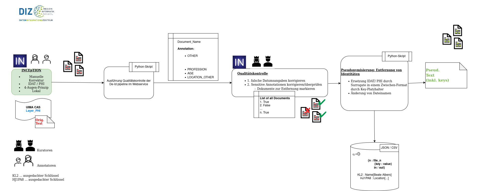

# GeMTeX-Surrogator

_*Note*: Some parts of this project are still under construction._

**Content**

* [Notes before Usage](#wnotes-and-information-before-usage)
* [Workflow](#workflow)
* [Configuration & Run](#configuration--run)
  * [Step 0: the Input](#step-0-the-input)
  * [Run Step 1: task `quality_control`](#run-step-1-task-quality_control)
  * [Run Step 2: task `surrogate`](#run-step-2-task-surrogate)
* [More Information about Data](#more-information-about-data)
* [Contact](#contact)


## Notes before Usage

This is the **_GeMTeX-Surrogator_**, a [Python](https://www.python.org)-based framework designed to enhance privacy in text documents by replacing pre-annotated and pre-processed sensitive information by replacing it with privacy-preserving placeholders.

### Annotation Scheme
The annotation scheme is based on the [GeMTeX de-identification type-system (annotation-layer)](https://github.com/medizininformatik-initiative/GeMTeX/tree/main/inception-projects):

1. `NAME`
   * `NAME_PATIENT`
   * `NAME_RELATIVE`
   * `NAME_DOCTOR`
   * `NAME_EXT`
   * `NAME_USERNAME`
   * `NAME_TITLE`
2. `DATE`
   * `DATE_BIRTH`
   * `DATE_DEATH`
   * `DATE`
3. `AGE`
4. `LOCATION`
   * `LOCATION_STREET`
   * `LOCATION_CITY`
   * `LOCATION_ZIP`
   * `LOCATION_COUNTRY`
   * `LOCATION_STATE`
   * `LOCATION_HOSPITAL`
   * `LOCATION_ORGANIZATION`
   * `LOCATION_OTHER`
5. `ID`
6. `CONTACT`
   * `CONTACT_PHONE`
   * `CONTACT_EMAIL`
   * `CONTACT_FAX`
   * `CONTACT_URL`
7. `PROFESSION`
8. `OTHER`

In alignment with the [Datenschutz-Konzept of the Medizininformatik-Initiative](https://www.medizininformatik-initiative.de/sites/default/files/2022-03/MII-Datenschutzkonzept_v1.0.pdf), there is a specific focus on the following types of sensitive information:

- **Names**
- **Date of Birth**
- **Date of Death**
- **Address details**
- **Identifiers** (e.g., insurance numbers, patient IDs from the hospital information system)

Currently, the pipeline is designed to automatically generate placeholders for these specific categories. Any remaining types of sensitive information are addressed manually during a subsequent quality control step.

## Workflow



### Step 0: The Input

* The **annotations** from the de-identification process, along with their corresponding **curations**, are required.
* Export the annotations using the **Curation Export Mode** and ensure the format is set to `UIMA XMI 1.0` or `UIMA JSON` 
* Example directory with 2 test projects: [test-data/projects](test-data/projects)

### Step 1: Quality Control

Before replacing sensitive entities in the text with surrogates, we recommend conducting a **quality control** step. This ensures that all sensitive entity annotations are accurately processed and appropriate surrogates can be generated. Some annotated entities may require manual inspection.

#### Categories Automatically Handled by Replacement Modes
The following categories are automatically processed by all replacement modes ([see supported modes](#run-step-2-task-surrogate)):

- **`NAME`** (including all sub-categories)
- **`DATE_BIRTH`** and **`DATE_DEATH`** (other `DATE` annotations are not prioritized during GeMTeX processing)
- **`LOCATION`**
- **`ID`**
- **`CONTACT`**

#### Categories Requiring Manual Inspection
The following categories are summarized in a tabular structure and require manual review. In certain cases, it may be necessary to exclude a document from further processing if needed:

- **`AGE`**: Any age above 89 should not permissible.
- **`PROFESSION`**: This category may contain sensitive information if the individual has an identifiable job or is a public figure (e.g., a mayor or minister).
- **`OTHER`**: Requires review of the annotated document to ensure accuracy; annotations may need to be adjusted.
- **`LOCATION_OTHER`**: This category may contain sensitive identifying information and should be carefully reviewed.


##### Examples of Lookups Using a Table Structure  
Refer to the table structure with [example GraSCCo annotations (&rarr; test_data/export_curated_documents_v2.zip](test_data/export_curated_documents_v2.zip):

&rarr; [test_data_out/quality_control/corpus_details_AGE.csv](test_data_out/quality_control/corpus_details_AGE.csv) (snippet)

| document         | AGE                 |
|------------------|---------------------|
| Boeck.txt        | {'28'}              |
| Colon_Fake_C.txt | {'50'}              |
| ...              | ...                 |
| Colon_Fake_I.txt | {'101', '82', '57'} |
| Fuss.txt         | {'6'}               |

&rarr; [test_data_out/quality_control/corpus_details_PROFESSION.csv](test_data_out/quality_control/corpus_details_PROFESSION.csv)

| document    | PROFESSION                |
|-------------|---------------------------|
| Boeck.txt   | {'Floristin'}             |
| Theodor.txt | {'Maschinenbauingenieur'} |


&rarr; [test_data_out/quality_control/corpus_documents.csv](test_data_out/quality_control/corpus_documents.csv) (example snippet)

The `corpus_documents.csv` table contains two columns:

1. **Document List**: Lists all documents in the corpus.
2. **Inclusion Toggle**: Allows toggling documents between inclusion and exclusion from the corpus based on manually reviewed entities.

- Documents marked with `1` are included in the corpus for further processing.  
- Documents with an `OTHER` annotation are automatically excluded and marked with `0`. This value can be manually adjusted if a document should be re-included.

This table serves as the input for the subsequent surrogate step. It must be manually reviewed and adjusted as it determines which documents will proceed to the next processing stage and be part of the final corpus.

| document   | part_of_corpus |
|------------|----------------|
| Stölzl.txt | 1              |
| Rieser.txt | 1              |
| ...        | ...            |
| Meyr.txt   | 0              |
| Dewald.txt | 1              |

&rarr; [test_data_out/quality_control/report_wrong_annotations.json](test_data_out/quality_control/report_wrong_annotations.json) (example snippet)

Annotations that do not conform to the [annotation schema](#annotation-scheme) are listed in this file. Documents containing these annotations must be reviewed and may need to be excluded from processing by updating the `corpus_documents.csv` table accordingly.

```json
{
  "Queisser.txt": [
    {
      "token_id": 9350,
      "text": "49",
      "token_kind": null
    }
  ]
}
```


### Step 2: `surrogate`

This pipeline provides the following modes, each offering a distinct approach to replacing sensitive information with surrogates.

* `gemtex` **&rarr; suggested in GeMTeX**
  * Placeholder notation for preserving identity without using real names
    * Example:
      * `Beate Albers` &rarr; `[** NAME_PATIENT FR7CR8 **]`
        * `NAME_PATIENT` : entity
        * `FR7CR8` : key

    `Wir berichten über lhre Patientin [** NAME_PATIENT FR7CR8 **] (* [** DATE_BIRTH 01.01.1997 **]), die sich vom 19.3. bis zum 7.5.2029 in unserer stat. Behandlung befand.`

## TODO hier umtauschen

  * This mode supports reversing the surrogate replacement process. Each replaced entity is assigned a unique key that stores the original value. These mappings are saved in a `JSON` file, such as 
  
    &rarr; [test_data_out/key_assignment_gemtex.json](test_data_out/key_assignment_gemtex.json).

    **Warning: This file is critical and must not be deleted, as it will be required in a later step.**

```json lines
    
      "TDC0FSP2": {
        "filename_orig": "Albers.txt",
        "annotations": {
          "NAME_PATIENT": {
            "OP7GE7": "Albers",
            "FR7CR8": "Beate Albers"
          },
          "DATE_BIRTH": {
            "DF7KK4": "4.4.1997"
          },
          "NAME_TITLE": {
            "MN0UB2": "Dr.med.",
            "GF6GK3": "Dr."
          },
          "NAME_DOCTOR": {
            "UF0OS2": "Siewert",
            "QD0YS1": "Bernwart Schulze"
          }
        }
      },
    
```

### Configuration & Run

#### Preparation

* Install [Python 3.11](https://www.python.org); 
* It is preferred, to use a [virtual environment](https://docs.python.org/3/library/venv.html)
* Install the following packages via [Pip](https://pypi.org/project/pip/), see [requirements.txt](requirements.txt)

```requirements.txt
dkpro-cassis
python-dateutil~=2.9.0.post0
pandas~=2.2.2
```

#### Data before Usage

* Input: [a zipped and *curated* INCEpTION annotation project](https://inception-project.github.io/) with GeMTeX PHI annotations, example: [test_data/export_curated_documents_v2.zip](test_data/export_curated_documents_v2.zip)

### Run Step 1: task `quality_control`

* Prepare a configuration file &rarr; example: [configs/parameters_quality_control.conf](configs/parameters_quality_control.conf)
  * `[input]`
    * `annotation_project_path` : set the path to your curated INCEpTION project export file, example: [`test_data/export_curated_documents_v2.zip`](`test_data/export_curated_documents_v2.zip`)
    * `task` : set to `quality_control` to run the quality control mode

```
[input]
annotation_project_path = test_data/projects/
task = quality_control
```
* Run: `python main.py parameters_quality_control.conf`

The output is stored in the (created) directory `quality_control`. 


### Run Step 2: task `surrogate`

* Prepare a configuration file &rarr; Example: [parameters_surrogates.conf](configs/parameters_surrogates.conf)
  * `[input]`
    * `annotation_project_path` : set the path to your INCEpTION project export file, example: [`test_data/export_curated_documents_v2.zip`]
      * **NOTE**: only format **`UIMA XMI 1.0`** is supported!
    * `task` : set to `surrogate` to run the surrogate mode
  * `surrogate_process`
    * `surrogate_modes` : modes for surrogate transformation, e.g., `[X, entity, gemtex]`
      * `X` : `Beate Albers` &rarr; `XXXXX XXXXXX`
      * `entity`: `Beate Albers` &rarr; `NAME_PATIENT`
      * `gemtex`: `Beate Albers` &rarr; `[** NAME_PATIENT XR5CR1 **]`
      * It is possible to combine the modes, e.g. `surrogate_modes = gemtex` or `surrogate_modes = X, entity, gemtex`
    * `corpus_documents`: A file containing a list of documents from the corpus that are eligible for processing by the surrogate process. Example: [`test_data_out/quality_control/corpus_documents.csv`](test_data_out/quality_control/corpus_documents.csv)  
      * This file is generated during the quality control process.  
      * If the file is not defined when starting, the quality control process will automatically run during the surrogate mode and generate this file.

  * `[output]`
    * `out_directory` : output directory, example [`test_data_out`](`test_data_out`)
    * `delete_zip_export` : delete the zip export from your INCEpTION project; set `true`, if you want to delete the export and `false`, if you want to look in the exported project files, the export files are stored in the defined `out_directory`.
    * `change_file_names`: Set to `true` if you want to modify the file names during the process, or `false` to keep the file names of the text documents unchanged.
    * `file_formats`: Specify the desired export formats:  
      * `txt`: Produces text files in `.txt` format.  
      * `xmi`: Produces files in `.xmi` format.  
      * It is possible to combine the modes, e.g. `file_formats = txt` or `file_formats = txt, xmi`.
    * `key_file`: *(Available only in `gemtex` mode!)* contains the assignment of the keys with their values in a json file. Example: [`test_data_out/key_assignment_gemtex.json`](`test_data_out/key_assignment_gemtex.json`)
    * `path_semantic_annotation`: *(Available only in `gemtex` mode!)* Specifies the path to the `.xmi` files with DATE normalization, which will be used as input for semantic annotation.

```
[input]
annotation_project_path = test_data/export_curated_documents_v2.zip
key_file = /home/chlor/PycharmProjects/GeMTeX-Pseudonymization/test_data_out/key_assignment.json
typesystem = /home/chlor/PycharmProjects/GeMTeX-Pseudonymization/resources/excepted_layers/GeMTeX/TypeSystem.xml
task = surrogate

[surrogate_process]
surrogate_modes = gemtex
corpus_files = test_data_out/quality_control/corpus_files.csv

[output]
out_directory = test_data_out
delete_zip_export = false
change_file_names = true
file_formats = txt, xmi
path_semantic_annotation = test_data_out/gemtex_sem-ann
```
* Run: `python main.py parameters_surrogates.conf`

## Further Information


* `TypeSystem.xml`: [UIMA](https://uima.apache.org/) TypeSystem file with GeMTeX PHI Schemes
* `*.xmi`: more details, see [CAS XMI XML representation](https://github.com/dkpro/dkpro-cassis?tab=readme-ov-file)

## Contact

If you have further questions, do not hesitate to contact [Christina Lohr](christina.lohr@imise.uni-leipzig.de) and [Marvin Seiferling](marvin.seiferling@outlook.de).